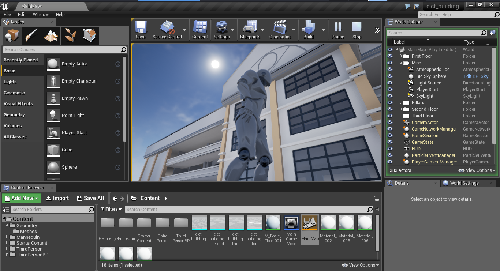

# CICT Unreal
The CICT Building in Unreal Game Engine integrated with a third person controller (VR ready).

## About
This project aims to develop a near-realistic replica of the CICT building. The project is still under heavy development. Feel free to use this asset in any of your projects. Contributions are welcome!

### Preview

## Missing Components
> Targeted on future updates.

* Doors
* Windows
* Extra lights
* Props
* Emergency fire exit
* Extra materials and textures
